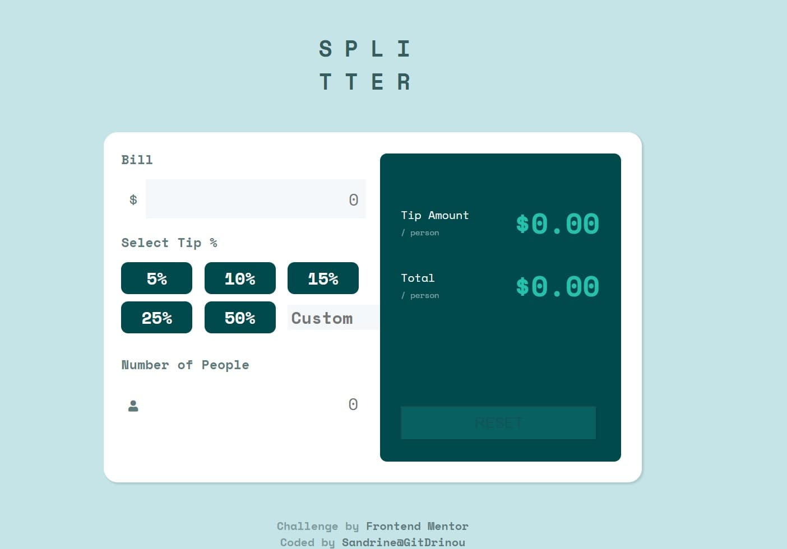

# Frontend Mentor - Tip calculator app solution - React App

This is a React App solution to the [Tip calculator app challenge on Frontend Mentor](https://www.frontendmentor.io/challenges/tip-calculator-app-ugJNGbJUX). Frontend Mentor challenges help you improve your coding skills by building realistic projects.

## Table of contents

- [Overview](#overview)
  - [The challenge](#the-challenge)
  - [Screenshot](#screenshot)
  - [Links](#links)
- [My process](#my-process)
  - [Built with](#built-with)
  - [What I learned](#what-i-learned)
  - [Useful resources](#useful-resources)
- [Author](#author)

**Note: Delete this note and update the table of contents based on what sections you keep.**

## Overview

### The challenge

Users should be able to:

- View the optimal layout for the app depending on their device's screen size
- See hover states for all interactive elements on the page
- Calculate the correct tip and total cost of the bill per person

### Screenshot

### Links

- Solution URL: [Add solution URL here](https://github.com/GitDrinou/FM-Tip-Calculator-React-App.git)
- Live Site URL: [Add live site URL here](https://fm-tip-calculator.pages.dev/)

## My process

### Built with

- Semantic HTML5 markup
- CSS custom properties
- [Sass](https://sass-lang.com/)
- Flexbox
- Mobile-first workflow
- [React](https://reactjs.org/) - JS library

### What I learned

I practice with React library and Sass.

### Useful resources

- [React Documentation1](https://fr.reactjs.org/docs/getting-started.html)

## Author

- Portfolio - [GitDrinou](https://gitdrinou.github.io/)
- Frontend Mentor - [@yourusername](https://www.frontendmentor.io/profile/yourusername)
